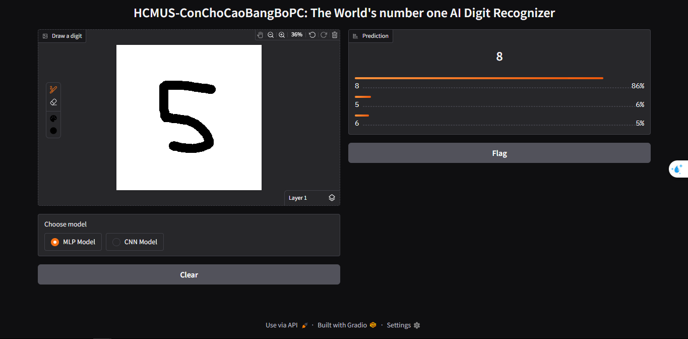
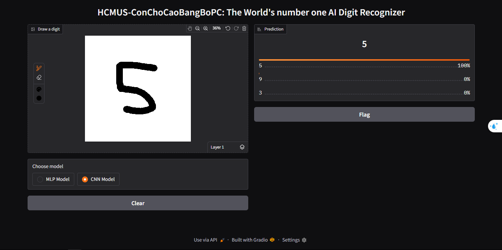

  

> Course Project **Introduction to Information Technology** > **Faculty of Information Technology - VNU-HCM University of Science**

This project implements and compares the performance of Deep Learning models (MLP & CNN) for handwritten digit recognition using the MNIST dataset. The project is built with a modular architecture, designed for extensibility and academic research purposes

---

## 📄 Documentation & Paper

The project is accompanied by a detailed scientific report, providing an in-depth analysis of the mathematical foundations and empirical evaluation.

👉 **[Read the full report (PDF)](./docs/final_article.pdf)**

---

## ✨ Key Features

* **Modular Architecture:** Clear separation between Data Loading, Model, Loss function, and Training loop.
* **Multi-Architecture Support:**
    * **MLP (Multi-layer Perceptron):** Fully Connected Neural Network, Basic Feed-Forward Network (Baseline).
    * **CNN (Convolutional Neural Network):** Convolutional network optimized for spatial feature extraction.
* **Reproducibility:** Hyperparameter management via `yaml` configuration files.
* **Logging & Visualization:** Real-time loss/accuracy tracking and prediction visualization.

## 📅 Project Timeline and Team Members (HCMUS-ConChoCaoBangBoPC)

Below is the implementation progress and task distribution of the team throughout the development process:


---

## 📂 Project Structure

```bash
digits_classification/
├── docs/                           # Project documentation
│   └── final_article.pdf           # Scientific report file
├── configs/                        # Configuration files
│   └── config.yaml                 # Main config (Epochs, LR, Model type...)
├── assets/                         # Image files
│   └── GanttChart.png              # Project Timeline
│   └── Figure_1.png                # A graph that compares loss over time between the two models during training
│   └── Figure_2.png                # A graph that compares accuracy over time between the two models after every epoch
│   └── Figure_3.png                # An evaluation table for the MLP Model
│   └── Figure_4.png                # An evaluation table for the CNN Model
│   └── cnn_interface.png           # User interface for the CNN Model
│   └── mlp_interface.png           # User interface for the CNN Model
│   └── demo.gif                    # Interactive Demo
│   └── cnn_confusion_matrix.pdf    # A confusion matrix for CNN Model
│   └── mlp_confusion_matrix.pdf    # A confusion matrix for MLP Model
│   └── mnist_samples_high_res.pdf  # Samples of the MNIST dataset
├── src/                            # Source code
│   ├── dataloader.py               # Data processing module (DataLoader, Transforms)
│   ├── model.py                    # Model architecture definitions (CNN, MLP)
│   ├── trainer.py                  # Training script
│   └── utils.py                    # Utilities (Visualization, reading from config.yaml, etc)
├── model                           # Directory for saving trained model weights
├── main.py                         # Perform all the training, validating, and result visualizing steps defined in 'src/.'      
├── app.py                          # Play a demo of both models
├── requirements.txt                # Project dependencies
└── README.md                       # README file
```  
---
## 🚀 Installation & Usage  
### 1. Environment Setup  
Requires Python 3.8+.
```bash
# Clone repository
git clone [https://github.com/username/digits-classification.git](https://github.com/username/digits-classification.git)
cd digits-classification

# Create virtual environment (Recommended)
python -m venv venv
source venv/bin/activate  # Linux/Mac
# venv\Scripts\activate   # Windows

# Install dependencies
pip install -r requirements.txt
```
### 2. Training  
You can modify parameters in ```configs/config.yaml``` before running.
```
python trainer.py --config configs/config.yaml
```
The model with the highest accuracy will be automatically saved to ```saved_models/```.  
### 3. Testing:  
Evaluate the model on the Test set:
```bash
python test.py --model_path saved_models/best_model.pth
```  
### 4. Interactive Demo (Gradio)
We provide a real-time web interface using Gradio to test both models interactively. This allows for a direct visual comparison of how each architecture handles spatial information.
#### Launch the Web App  
```
python app.py
```
#### Demo Preview  
A demonstration of the real-time digit recognition process.
<p align="center">
  
  <br>
  <i>Figure 1: Real-time inference demo. The system processes $28 \times 28$ handwritten inputs and provides instantaneous classification scores.</i>
</p>
#### 🔍 Side-by-Side Comparison: MLP vs. CNN
As discussed in our analysis, the MLP model often struggles with subtle geometric variations due to its flattened input. In contrast, the CNN leverages convolutional filters to maintain spatial correlations.

<table style="width: 100%; border-collapse: collapse;"> <tr> <td align="center" width="50%"><b>Multi-Layer Perceptron (MLP)</b></td> <td align="center" width="50%"><b>Convolutional Neural Network (CNN)</b></td> </tr> <tr> <td></td> <td></td> </tr> <tr> <td align="center"><i>MLP result showing higher ambiguity in probabilities</i></td> <td align="center"><i>CNN result showing robust spatial feature extraction</i></td> </tr> </table>
---
## 👥 Researchers:

### HCMUS - CONCHOCAOBANGBOPC - 25CTT3

| Members | StudentID |
| :--- | :--- |
| Nguyen Minh Nhat | 25120215 |
| Vu Thanh Phong | 25120219 |
| Do Le Nhat Quang | 25120223 |
| Nguyen Phu Quang | 25120224 |
| Nguyen Vu Nhat Quang | 25120225 |
| Pham Dang Quang | 25120226 |

Lab Instructor: Mr. Le Duc Khoan.

---

## 📝 License
This project is distributed under the MIT license.


